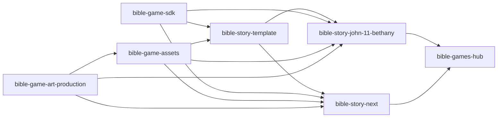

# 圣经故事游戏多仓库与共用库架构建议

> 目标：以后可以持续创建很多彼此独立、容易调试的圣经故事游戏，同时共用成熟的
> 引擎、UI、素材、MAI/Speech 工具和发布入口。

## 1. 最终建议

采用“平台仓库 + 素材仓库 + 模板仓库 + 每故事独立仓库 + Hub 仓库”：



关键判断：

- **每个故事一个独立 repo。**
- **不要每个共用 package 又拆成一个 repo。**
- 共用代码放在一个 `bible-game-sdk` repo 内部，以 npm workspaces 管理。
- 共用运行时素材放在一个 `bible-game-assets` repo，以版本化 asset packs 发布。
- 大型候选图和源文件不放进每个故事 repo。
- Hub 不直接 import 故事代码，只读取 release manifest 和静态构建产物。

这样同时满足：

- 单故事容易启动和 debug。
- 共用 bug 只修一次。
- 每个故事可以锁定已知稳定版本。
- Hub 故障不会影响单个游戏。
- 新故事不会复制整份旧游戏后逐渐分叉。

## 2. 建议的 GitHub 所有权

故事数量多后，建议建立一个专用 GitHub Organization，而不是长期散落在个人帐号。

例如：

```text
<github-org>/bible-game-sdk
<github-org>/bible-game-assets
<github-org>/bible-game-art-production
<github-org>/bible-story-template
<github-org>/bible-story-john-11-bethany
<github-org>/bible-story-<next-id>
<github-org>/bible-games-hub
```

如果暂时不建立 organization，也可先用当前 owner：

```text
sonic74129/<repo-name>
```

后续 GitHub 支持转移 repository，但 package scope、Pages URL、Actions permissions 和
文档链接需要一起调整，因此最好在第三个故事前确定长期 owner。

## 3. Repository 分类

### 3.1 `bible-game-sdk`

职责：所有故事共用的 TypeScript/Phaser 代码和测试工具。

建议内部结构：

```text
packages/
  engine/
  story-runtime/
  map-runtime/
  sequence-runtime/
  audio-runtime/
  ui/
  content-schema/
  asset-client/
  art-pipeline/
  test-kit/
  create-story/

examples/
  minimal-story/
```

建议 package：

| Package | 职责 |
| --- | --- |
| `@bible-game/engine` | Phaser 启动、scene 生命周期、输入与 resize |
| `@bible-game/story-runtime` | StoryBeat、StoryEngine、final state |
| `@bible-game/map-runtime` | 导航、碰撞、区域、触发、actor registry |
| `@bible-game/sequence-runtime` | 地图内走位、姿态、镜头、对话、音乐序列 |
| `@bible-game/audio-runtime` | MusicManager、VoiceManager、ducking、fallback |
| `@bible-game/ui` | 对话、肖像、姓名牌、目标、暂停和响应式 |
| `@bible-game/content-schema` | scripture/story/map/voice/asset schema |
| `@bible-game/asset-client` | 解析 asset pack、校验 hash、复制到 build |
| `@bible-game/art-pipeline` | MAI registry、manifest、处理和审图工具 |
| `@bible-game/test-kit` | 合同测试、假 adapter、playthrough helpers |
| `@bible-game/create-story` | 初始化新故事配置和目录 |

为什么 SDK 内部仍使用 monorepo：

- 这些 packages 同时修改的频率高。
- 类型、adapter 与测试需要同步。
- 一个 SDK PR 可以验证所有 package。
- 可以统一版本发布，避免 package 组合爆炸。

但故事 repo 不放进这个 workspaces。

### 3.2 `bible-game-assets`

职责：批准的共用运行时素材、资产 manifest 和时代/地区包。

建议：

```text
packs/
  core-ui/
  common-audio-ui/
  nt-judea-first-century/
    environment/
    props/
    characters/
    identity-masters/
  ot-egypt/
  ot-canaan/

catalog/
  asset-catalog.json

schemas/
tests/
```

只放：

- 已批准的、经过处理的 runtime assets。
- identity master 与复用范围。
- source provenance。
- license/rights metadata。
- 尺寸、hash、style version 和兼容版本。

不要放：

- 未审查候选。
- 大量 contact sheets。
- 每次 MAI retry 的全部原始文件。
- 某一个故事的完整地图。
- 与具体经文绑定的正式语音。
- 故事专用 trigger、坐标或演出。

初期可由一个 repo 管理所有 packs。只有在以下情况才拆为多个 asset repos：

- clone/build 已明显过重。
- 不同年代由不同团队维护。
- 授权或访问权限不同。
- 发布节奏完全不同。

不要一开始创建“一个树 repo、一个房屋 repo、一个角色 repo”。

### 3.3 `bible-game-art-production`

职责：集中执行 MAI、处理大文件和控制 Azure capacity 1。

这是根据项目实际经历新增的关键仓库。多个故事 repo 若同时调用
`mai-image-2-5-pro`，会互相抢 quota 并出现 429。

建议职责：

- 串行 MAI 工作队列。
- Azure 资源核对与 Entra-only workflow。
- 单输出 run、自动验收、版本与回滚记录。
- 大型源图与处理日志。
- 将批准后的 runtime 资产发布到：
  - `bible-game-assets`，若可共用。
  - 对应故事 repo，若故事专用。

故事 repo 仍然拥有自己的 prompt 意图和 story contract；生产仓库执行时使用明确
的 story commit、asset ID 和 prompt version，不能依赖“当前聊天里的最新描述”。

建议输入：

```json
{
  "storyRepo": "<github-org>/bible-story-john-11-bethany",
  "storyCommit": "<full-sha>",
  "assetId": "environment.world-map",
  "promptVersion": "v1",
  "mode": "start"
}
```

建议输出：

- run manifest。
- 每个资产第一轮恰好一个 generated source。
- 自动验收记录。
- 已处理并接线的 runtime output。
- provenance、version 与 SHA-256。
- 目标 repo PR。

多个 candidates、contact sheet 或人工选择只允许作为明确例外；默认 run 必须自动检查并
直接推进到 runtime 接线。resume 跳过已经关闭的 asset ID，失败只升版重做受影响资产。

#### 大型文件保存

优先顺序：

1. Azure Blob/private artifact storage 保存候选和大型 source。
2. GitHub Release 保存批准的版本化 runtime pack。
3. 只有团队明确接受成本时，才用 Git LFS 保存全部生产源。

普通 Git history 不适合反复提交大型 PNG 候选。

### 3.4 `bible-story-template`

职责：GitHub Template Repository，只提供一个新故事的最小可运行骨架。

它不复制 SDK 源码，只依赖已发布 package。

模板必须包含：

- 最小 Phaser 启动。
- 三个灰盒 StoryBeat。
- 两名示例角色。
- 一张最小地图。
- scripture/schema 示例。
- stage goal 示例。
- voice manifest 空模板。
- asset lock。
- unit/contract/browser smoke tests。
- CI、release 和 secret scan。
- README 中的新故事清单。

模板版本也要发布 tag。每个故事 manifest 记录创建时使用的模板版本。

### 3.5 每个故事 repo

命名：

```text
bible-story-<book>-<chapter-or-range>-<slug>
```

示例：

```text
bible-story-john-11-bethany
bible-story-luke-15-prodigal-son
bible-story-exodus-3-burning-bush
bible-story-acts-9-damascus
```

每个 repo 是一个完整静态游戏：

- 可以自己 `npm install`。
- 可以自己 `npm run dev`。
- 可以自己测试与 build。
- 有独立 release、issue、PR 和版本。
- 即使 Hub 或其他故事损坏也能运行。

### 3.6 `bible-games-hub`

职责：

- 游戏目录。
- 封面、书卷、经文范围、语言、时长和完成状态。
- 启动、继续、重开。
- 全局音量、字幕、语言和全屏偏好。
- 拉取各故事 release artifact 并部署到统一路径。

Hub 不负责：

- StoryEngine。
- 地图和人物状态。
- 故事存档内部格式。
- 把所有游戏代码合成一个 bundle。
- 直接依赖某故事源码。

## 4. 共用库的准确边界

### 4.1 放进 SDK

- 输入和玩家控制。
- 点击寻路。
- NavigationGrid。
- ActorRegistry。
- Trigger/ProximityTrigger。
- MapSequence 与 adapter。
- StoryEngine 基础状态机。
- Input lock。
- Camera sequence。
- UI shell。
- Music/Voice runtime。
- 资产加载、hash 与错误处理。
- 测试 helpers。

### 4.2 放进共用资产包

- 对话框和 UI 图标。
- 通用材质、色板和 style tokens。
- 同时代的地面、墙、树、器皿、家具。
- 匿名人物基础形态。
- 同一时期重复人物的 identity master。
- 已证明可复用的普通行走和待机状态。

### 4.3 留在故事 repo

- 正式经文。
- VerseBeats。
- StageGoals。
- 完整地图和布局。
- 故事人物出现顺序与状态。
- 特殊动作和关键物件。
- Story-specific portraits。
- Voice cue、SSML、text hash 和 MP3。
- 分数与回想题。
- 故事结尾。
- 完整 playthrough 测试。

### 4.4 资产提升流程

不要一生成就放进共用库：

```text
故事本地使用
-> 在实际游戏验证
-> 确认至少第二个故事也需要
-> 核对时代、身份、授权和尺寸
-> 发布为新 asset pack version
-> 原故事明确升级到该版本
```

“看起来以后可能有用”不足以成为共享资产。

## 5. Package 与资产发布

### 5.1 SDK packages

推荐发布到 GitHub Packages npm registry：

```text
@bible-game/engine
@bible-game/story-runtime
@bible-game/map-runtime
...
```

上面的 `@bible-game` 是逻辑示例。使用 GitHub Packages 时，实际 npm scope 必须与
GitHub user/organization owner 一致；若 organization 名为 `<github-org>`，应发布为：

```text
@<github-org>/engine
@<github-org>/story-runtime
...
```

故事 repo 的 `.npmrc` 只保存 registry 与环境变量引用，不保存实际 token：

```text
@<github-org>:registry=https://npm.pkg.github.com
//npm.pkg.github.com/:_authToken=${NODE_AUTH_TOKEN}
```

GitHub Actions 使用有 `packages: read` 权限的 `GITHUB_TOKEN` 或组织批准的最小权限
token；本地 token 只放环境变量或用户级 npm 配置。

故事 repo 使用固定兼容版本：

```json
{
  "dependencies": {
    "@bible-game/engine": "1.2.1",
    "@bible-game/story-runtime": "1.2.1",
    "@bible-game/map-runtime": "1.2.1",
    "@bible-game/audio-runtime": "1.2.1",
    "@bible-game/ui": "1.2.1"
  }
}
```

初期建议 SDK packages 使用统一 release version，减少兼容组合。

不得使用：

- `latest` 作为生产依赖。
- 未固定的 `main` branch dependency。
- 本机绝对路径。
- 从另一个故事 repo import 源码。

### 5.2 Asset packs

小型 pack 可以作为 npm package。较大 pack 建议作为 GitHub Release tarball 或私有
Blob artifact。

每个故事保留：

```text
assets.lock.json
```

例如：

```json
{
  "schemaVersion": "1.0.0",
  "packs": [
    {
      "id": "core-ui",
      "version": "1.0.0",
      "source": "github-release",
      "sha256": "<pack-sha256>"
    },
    {
      "id": "nt-judea-first-century",
      "version": "1.1.0",
      "source": "github-release",
      "sha256": "<pack-sha256>"
    }
  ]
}
```

构建前由 `@bible-game/asset-client` 下载并校验，复制到故事自己的 build。运行时不依赖
远端素材服务器，因此游戏仍可离线和独立部署。

## 6. Story repo 标准结构

```text
.github/
  CODEOWNERS
  workflows/
    ci.yml
    release.yml

art/
  prompts/
  story-style.json

public/
  assets/
    local/
    vendor/                  # build/sync 生成，不手工改

src/
  story/
    story.config.ts
    scripture.ts
    actors.ts
    beats.ts
    stage-goals.ts
    questions.ts
    dialogue.ts
    sequences.ts
    completion.ts
    voice-manifest.ts
  world/
    layout.json
    anchors.json
    collisions.json
    navigation.json
    spawns.json
  adapters/
    StoryScene.ts
  main.ts

production/
  approved-manifests/
  audio-source/

tests/
  scripture.test.ts
  beats.test.ts
  world.test.ts
  assets.test.ts
  voice.test.ts
  playthrough.test.ts

assets.lock.json
game.manifest.json
package.json
package-lock.json
tsconfig.json
vite.config.ts
README.md
```

原则：

- `src/story` 不 import Phaser。
- `src/adapters` 才把纯 story contract 接到 SDK。
- `public/assets/local` 只放故事专用 runtime 文件。
- 候选图片不进入普通 Git history。
- `public/assets/vendor` 根据 lock 重建，不作为人工真相。

## 7. 新故事 repo 的创建流程

### 7.1 命名与立项

先填写：

- repository name。
- story ID。
- 书卷、章节、经文范围和译本。
- 中文标题与英文 slug。
- 目标时间。
- 玩家身份。
- 时代/地区 asset pack。
- scripture reviewer。
- art reviewer。

稳定 ID 示例：

```text
repo: bible-story-luke-15-prodigal-son
storyId: luke-15-prodigal-son
route: /games/luke-15-prodigal-son/
storage namespace: bible-games:save:luke-15-prodigal-son:v1
```

### 7.2 从 GitHub template 创建

未来模板 repo 建立后：

```bash
gh repo create <github-org>/bible-story-luke-15-prodigal-son \
  --template <github-org>/bible-story-template \
  --private \
  --clone
```

进入新 repo 后：

```bash
npm ci
npx @bible-game/create-story@1 \
  --id luke-15-prodigal-son \
  --title "浪子回家" \
  --book Luke \
  --chapter 15 \
  --verses 11-32 \
  --translation CUV-Simplified \
  --era-pack nt-judea-first-century
```

初始化 CLI 只创建配置和示例数据，不生成图片、不调用 Azure，也不伪造经文审核。

### 7.3 第一个提交

第一个提交必须已经满足：

- repo 名、story ID、route 和 storage namespace 一致。
- SDK 与 asset pack 固定版本。
- game manifest 可解析。
- 空白经文明确标记 `unreviewed`。
- 灰盒可启动。
- 三个示例 Beat 测试通过。
- CI 可运行。
- 无 Azure token/key。

### 7.4 正式制作

按照制作规范执行：

1. 读取唯一 Story Plan 并派生完整资产 inventory。
2. 只建立最小 map/identity/scale/camera/text contract。
3. 完成、处理并接入第一版正式资产 baseline。
4. 用 development-only entry/fixture 逐 Beat/Stage 验证。
5. 关闭其余正式地图、人物、姿态、肖像、道具、UI、语音、音频与 SFX。
6. 玩法稳定后集中 code review/refactor。
7. 最后细节润色与 normal/all-skip/mobile QA。
8. release。

## 8. Story manifest 与 Hub contract

每个 release 根目录输出：

```text
game.manifest.json
dist.zip
dist.sha256
```

Manifest 示例：

```json
{
  "schemaVersion": "1.0.0",
  "id": "john-11-bethany",
  "version": "1.0.0",
  "templateVersion": "1.0.0",
  "title": "伯大尼见证者",
  "passage": {
    "book": "John",
    "chapter": 11,
    "verses": "1-46",
    "translation": "CUV-Simplified"
  },
  "engineApiVersion": 1,
  "sdkVersion": "1.2.1",
  "stylePack": "storybook-realism-v1",
  "assetPacks": {
    "core-ui": "1.0.0",
    "nt-judea-first-century": "1.1.0"
  },
  "entry": "/games/john-11-bethany/",
  "estimatedMinutes": 12,
  "languages": ["zh-CN"],
  "capabilities": {
    "keyboard": true,
    "pointer": true,
    "touch": true,
    "voice": true,
    "offlineAfterLoad": true
  },
  "artifactSha256": "<dist-sha256>"
}
```

Hub 只依赖这份 contract，并只接收通过全部发布门禁的 immutable release。不得增加
production stage、readiness flag、approval state 或 delivery-policy schema 来代替发布验证。

## 9. 统一部署但保持 repo 独立

推荐生产方式：

```text
每故事 repo
  -> release dist.zip
  -> Hub deployment workflow 下载固定 release
  -> 校验 sha256
  -> 解压至 /games/<story-id>/
```

最终网址：

```text
/                              Hub
/games/john-11-bethany/        独立游戏构建
/games/luke-15-prodigal-son/   独立游戏构建
```

优点：

- 同源，`return`、设置和进度容易共享。
- 每个故事仍有独立源码、CI 和 release。
- Hub 部署可以固定故事版本，不被故事 repo 新提交自动破坏。
- 回滚只需要把 catalog 指回旧 release。

开发环境也可让每个游戏单独运行在自己的 localhost port。

## 10. 存档与跨游戏通信

### 10.1 命名空间

```text
bible-games:settings:v1
bible-games:progress:<story-id>:v1
bible-games:save:<story-id>:v1
```

### 10.2 Hub 可见数据

只允许：

- `not-started`
- `in-progress`
- `completed`
- 最后游玩时间。
- 故事版本。

Hub 不读取：

- 当前 Beat 内部对象。
- ActorRegistry。
- 地图坐标。
- 对话索引。
- 故事专用状态机。

故事完成时通过稳定 host API 或 namespaced progress record 通知 Hub。

## 11. 版本策略

### 11.1 SDK

- SemVer。
- Patch：bug fix，不改变 contract。
- Minor：向后兼容能力。
- Major：breaking API 或 schema。
- Story repo 锁定准确版本与 package-lock。

### 11.2 Asset pack

- Patch：同尺寸、同身份、同用途的无破坏修复。
- Minor：新增资产。
- Major：删除/改 ID、尺寸、identity 或 style contract。
- 每个 pack 有 manifest 和 hash。

### 11.3 Story

- 每个故事独立 SemVer。
- Story release 记录 SDK、asset pack、template 和 scripture revision。
- 不因 Hub 发布而自动升级故事。

### 11.4 Schema

所有公开文件包含：

```text
schemaVersion
```

Hub 支持有限的旧 schema；不能在没有迁移器时直接读取未来结构。

## 12. CI 与发布门禁

### 12.1 SDK CI

- typecheck。
- package unit tests。
- adapter tests。
- minimal-story integration。
- API surface check。
- package publish dry-run。

### 12.2 Asset CI

- manifest schema。
- ID 唯一。
- dependency closure。
- 文件存在、尺寸、格式和 hash。
- alpha/transparency。
- banned/retired path。
- license/provenance。
- pack build。

### 12.3 Story CI

- scripture contract。
- Beat 顺序和可达性。
- normal/skip final-state parity。
- world anchor/navigation。
- asset lock/hash。
- voice exact-text/hash。
- responsive UI contract。
- full story build。
- secret scan。

### 12.4 Release gate

- 一次正常完整游玩。
- 一次全 skip。
- `1280x720`。
- `390x844`。
- console/page/unhandled/404 为 0。
- 发布包不含候选、token、key 或生产缓存。
- `game.manifest.json` 与 dist hash 一致。

## 13. Debug 工作流

### 13.1 故事本地 bug

在故事 repo 修复：

- 经文、Beat、坐标、地图、人物状态。
- 特殊姿态、肖像、语音。
- Story adapter。

只运行该故事的测试与 build，不启动其他故事。

### 13.2 SDK bug

流程：

1. 在故事 repo 做最小复现。
2. 把复现转为 SDK test。
3. 在 `bible-game-sdk` 修复。
4. 发布 patch。
5. 只给受影响故事开升级 PR。
6. 故事验证通过后合并。

不得把 SDK 源码复制回故事 repo 临时改一份。

### 13.3 Asset bug

流程：

1. 判断是故事摆放问题还是共享资产本身问题。
2. 共享资产修复后发布新 pack version。
3. 故事显式更新 `assets.lock.json`。
4. 重新做尺寸、碰撞和视觉测试。

### 13.4 快速回退

故事 repo 的 lockfile 和 asset lock 使回退可重复：

- 回退 story release。
- 或锁回旧 SDK/asset version。
- Hub catalog 指回旧 artifact。

其他故事不受影响。

## 14. GitHub 治理

每个故事 repo 建议：

```text
main                    受保护
feature/*               普通开发
art/*                   prompt/asset integration
release/*               必要时的稳定分支
```

Required checks：

- CI。
- scripture contracts。
- build。
- secret scan。

CODEOWNERS 示例：

```text
/src/story/scripture.ts       @scripture-reviewer
/src/story/beats.ts           @narrative-owner
/art/prompts/                 @art-owner
/production/audio-source/     @audio-owner
/.github/workflows/           @platform-owner
```

建议保持 private，直到：

- 经文译本授权确认。
- 音乐授权确认。
- AI 资产 provenance 完整。
- 发布内容审核完成。

## 15. 不建议的做法

- 一个巨大 repo 放所有故事、所有候选和所有 build。
- 一个 repo 对应一个 SDK 小 package。
- Git submodule 连接所有故事和共享库。
- 故事依赖另一个故事 repo。
- 故事引用 SDK `main`。
- 运行时从共享 repo/CDN 拉取会变化的 `latest` 素材。
- 所有 story repos 同时直接调用 capacity 1 的 MAI。
- 把 Azure token 放到故事 repo secret 以外的位置。
- 每个故事复制一套 MAI/Speech 脚本再独立演化。
- Hub 直接读取故事内部存档。

Git submodule 不建议作为默认方案，因为：

- 新开发者容易忘记初始化或更新。
- commit 指针和分支状态不直观。
- CI、模板和批量升级复杂。
- npm package + versioned release 更适合代码和资产分发。

## 16. 从当前 JohnRPGGame 迁移

建议顺序：

1. 选定一个新的完整 QA 游戏基线。
   - 不能直接把所有后期聚焦 branch tip 互相 merge。
   - 从 `660e3f9` 或明确后继开始，逐项重放已批准修复。
2. 重新跑完整 QA，得到真正的 Bethany release candidate。
3. 创建 `bible-game-sdk`。
4. 先抽出已有测试保护的通用模块。
5. 创建 `bible-game-assets`，只提升已证明可复用的 runtime 资产。
6. 将当前 repo 转为或迁移到
   `bible-story-john-11-bethany`。
7. 创建 `bible-story-template`。
8. 用第二个故事验证 SDK、asset pack 和模板。
9. 第二个故事发布后创建 `bible-games-hub`。
10. 最后再自动化中央 MAI production queue 和 Hub 聚合发布。

## 17. 分阶段落地，避免过度设计

### 第一阶段：两个故事以内

只建立：

- `bible-game-sdk`
- `bible-game-assets`
- `bible-story-template`
- 独立故事 repos

MAI 仍由一个操作者串行执行。

### 第二阶段：第二个故事完成

- 验证哪些资产真正可复用。
- 建立 Hub。
- 建立统一 release manifest。
- 自动拉取 story artifacts。

### 第三阶段：三个以上故事

- 中央 `bible-game-art-production` 队列。
- 自动 SDK/asset update PR。
- asset pack 按时代拆分。
- 独立 infra/IaC repo（如确有需要）。
- 更完整的跨故事进度与内容目录。

## 18. 最终推荐拓扑

现在最合适的目标不是“每个故事完全复制一切”，也不是“全部塞进一个 monorepo”。

推荐：

```text
1 个 SDK repo
1 个共享资产 repo
1 个故事模板 repo
N 个独立故事 repos
1 个 Hub repo（第二个故事后）
1 个中央美术生产 repo（规模扩大后）
```

每个故事独立，平台能力版本化，共享素材按实际复用提升，最终由 Hub 统一管理和展示。
